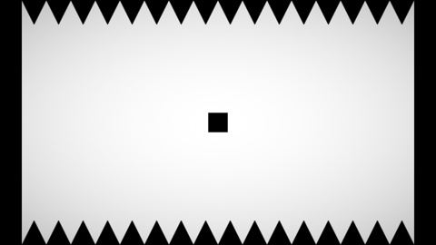
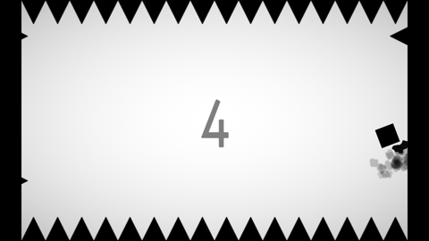

# Jumping Square

# Summary

- Genre: arcade
- Platform: browser
- Engine: unity

# Gameplay
- Player click to jump.
- Player get point when touch the walls.
- Avoid the spikes. 

## Player

## Spike

## Screenshots

## Unity Play
[Here](https://play.unity.com/mg/other/jumping-square-1)

## Author
Kiệt

